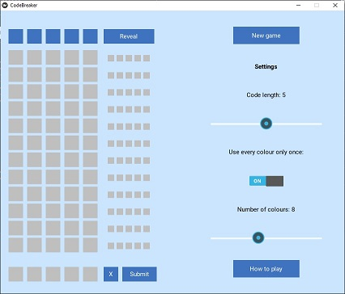
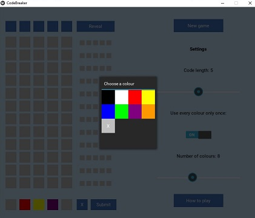
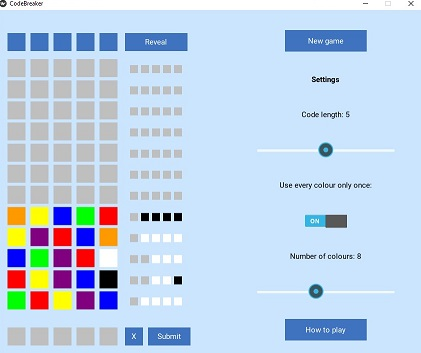

# Codecracker

## Description
A desktop game written in Python using the [Kivy](https://kivy.org/) library.

The computer generates a secret code that consists of different colours. The player gets up to 12 guesses to crack the code, receiving feedback after each guess.

## Getting Started
If you'd just like to play the game on Windows and you're not worried about downloading some stranger's executable file, you can download the [codecracker.exe](https://www.dropbox.com/scl/fi/fe78lq6zgbzy3mi07bgt4/codecracker.exe?rlkey=i051wikzvu80wdgptmedvx08o&dl=0) file.

Otherwise, you'll need install Kivy in order to run the main.py file. Please see the [Kivy website](https://kivy.org/doc/stable/gettingstarted/installation.html) for installation instructions.

## How to Play
The goal of the game is to guess the secret code that was generated by the computer.
To do this, you will input guesses, and receive feedback on each guess.
A black peg means you correctly guessed a colour AND position. A white peg means you correctly guessed a colour, but you got the position wrong.
Feedback pegs are ordered by colour - their position is not meaningful.

To play to game, click on the buttons at the bottom of your screen.
A colour menu will pop up.
Choose a colour from the menu. Repeat for the remaining input spots.
When you have chosen a colour for each position, click the submit button. To clear your current guess, click the X.

Keep guessing, using the feedback provided, until you crack the code.
Good luck!

## Change Settings
You can change the code length (default 5), the number of colours to choose from (default 8), and whether each colour can be used more than once in the code. Use the sliders and toggle on the right to change the settings. When you start a new game, the secret code will meet the new criteria.

## Screenshots

